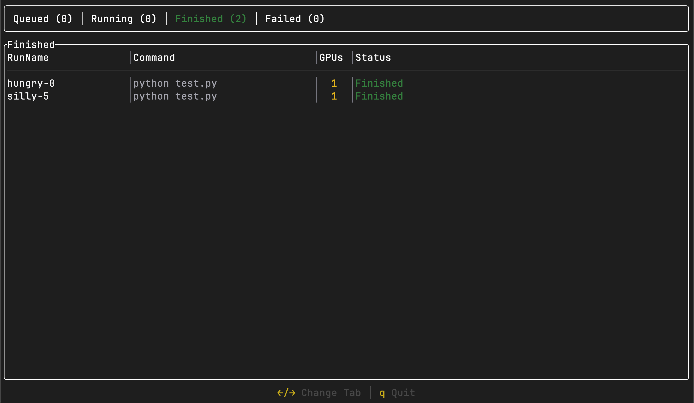

# gflow - GPU Job Scheduler


 
 
[](https://deps.rs/repo/github/AndPuQing/gflow)
 

`gflow` is an efficient tool for scheduling and managing GPU tasks, supporting task submission from the command line and running tasks in the background. Built in Rust, it provides a simple and easy-to-use interface for single-node or ~~distributed~~ GPU task scheduling.

## Snapshot



## Key Features

- **GPU Task Scheduling:** Supports queuing, scheduling, and management of GPU tasks.
- **Parallel Execution:** Allows multiple GPU tasks to run simultaneously, maximizing GPU resource utilization.
- **Command-Line Tool:** Provides the CLI tool `gflow` for submitting tasks, and `gflowd` for background task scheduling.
- **tmux Integration:** Uses tmux to manage background tasks and track task execution status in real-time.
- **TCP Submission:** Submit tasks via a TCP service, making it easy to integrate with other systems.

## Installation

### Install via `cargo` (Recommended)

You can use `cargo` to compile and install `gflow` and `gflowd`:

```bash
cargo install gflow
```

### Build Manually

1. Clone the repository:

   ```bash
   git clone https://github.com/AndPuQing/gflow.git
   cd gflow
   ```

2. Build the project using `cargo`:

   ```bash
   cargo build --release
   ```

   This will generate the `gflow` and `gflowd` executables in the `target/release/` directory.

## Usage

### Start the Scheduler

Start the GPU task scheduler using `gflow`:

```bash
gflow up
```

### Submit a Task

#### Submit scripts using the `gflow` CLI

Submit GPU tasks using the `gflow` command-line tool:

```bash
gflow submit test.sh --gpu 1 --conda-env myenv
```

- `--gpu`: The number of GPUs to allocate for the task.
- `--conda-env`: The Conda environment to activate before running the task.

#### Submit commands using the `gflow` CLI

Submit GPU tasks using the `gflow` command-line tool:

```bash
gflow submit "python test.py" --gpu 1 --conda-env myenv
```

### Task Scheduling Flow

1. When submitting a task, `gflow` sends a TCP request to the scheduler.
2. The `gflowd` scheduler allocates tasks based on available GPU resources.
3. Background tasks are executed using `tmux`, and the scheduler monitors task status in real-time.
4. The scheduler ensures each task is executed on suitable resources and allocates GPUs in priority order.

> [!WARNING]
> The `gflow` does not save task snapshots, meaning that if the associated files are deleted, the task will fail.


## Configuration

`gflow` and `gflowd` provide several configuration options that you can adjust as needed:

- Configuration files: You can customize the scheduling behavior by modifying the `gflowd` configuration file.
- Environment variables: For example, set `GFLOW_LOG_LEVEL=debug` to configure the logging level.

## Contributing

If you find any bugs or have feature requests, feel free to create an [Issue](https://github.com/AndPuQing/gflow/issues) and contribute by submitting [Pull Requests](https://github.com/AndPuQing/gflow/pulls).

## TODO

- [ ] Support GPU task scheduling in a multi-node environment.
- [ ] Add task prioritization and resource quota management.
- [ ] Improve task retry mechanism on failure.
- [ ] Implement task result feedback and log management.

## License

`gflow` is licensed under the MIT License. See [LICENSE](./LICENSE) for more details.
